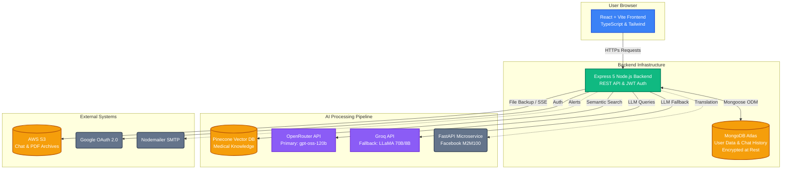

# 🏥 Healthcare Chatbot — NEXA

An intelligent healthcare assistant powered by **RAG (Retrieval-Augmented Generation)**, multi-model AI fallback, and cloud storage. Features appointment booking via conversational AI, multilingual support, and medical document analysis.

---

## 🏗️ Architecture



---

## 📦 Tech Stack

| Layer | Technology |
|---|---|
| **Frontend** | Vite + React + TypeScript + Tailwind CSS |
| **Backend** | Node.js + Express 5 + TypeScript |
| **Database** | MongoDB (Mongoose ODM) |
| **Auth** | JWT + Google OAuth 2.0 |
| **AI / LLM** | OpenRouter (Primary) + Groq LLaMA (Fallback) |
| **RAG** | Python FAISS + SBERT (`all-MiniLM-L6-v2`) |
| **Translation** | FastAPI + Facebook M2M100 |
| **Cloud** | AWS S3 (chat backups, file uploads) |
| **Email** | Nodemailer (Gmail SMTP) |

---

## 🔽 Clone the Repository

```bash
git clone https://github.com/karthick346t/Healthcare_Chatbot.git
cd Healthcare_Chatbot
```

---

## ⚙️ Backend Setup

### 1️⃣ Install Required Tools

```bash
npm install -g pnpm
```

---

### 2️⃣ Environment Configuration

Create a `.env` file in the `backend/` directory:

```bash
cd backend
copy NUL .env     # Windows
# OR: touch .env  # Mac/Linux
```

> [!IMPORTANT]
> The backend will **fail to start** and print a clear error message if any of the required variables below are missing.

#### Required Variables

| Variable | Description | How to Get |
|---|---|---|
| `JWT_SECRET` | Secret for signing tokens | `node -e "console.log(require('crypto').randomBytes(64).toString('hex'))"` |
| `MONGO_URI` | MongoDB connection string | MongoDB Atlas → Connect → Drivers |
| `OPENROUTER_API_KEY` | Primary LLM API key | [openrouter.ai/keys](https://openrouter.ai/keys) |
| `GROQ_API_KEY` | Fallback LLM (LLaMA) key | [console.groq.com/keys](https://console.groq.com/keys) |
| `AWS_ACCESS_KEY_ID` | IAM User Access Key | AWS Console → IAM → Users |
| `AWS_SECRET_ACCESS_KEY` | IAM User Secret Key | (shown once on key creation) |
| `AWS_BUCKET_NAME` | S3 Bucket name | `healthcare-chatbot-history` |

#### Optional Variables

| Variable | Description | Default |
|---|---|---|
| `NODE_ENV` | Environment mode | `development` |
| `PORT` | Backend port | `4000` |
| `AWS_REGION` | AWS region | `us-east-1` |
| `FRONTEND_ORIGIN` | Allowed CORS origin(s), comma-separated | `http://localhost:5173` |
| `EMAIL_USER` | Gmail address for notifications | *(empty — emails disabled)* |
| `EMAIL_PASS` | Gmail App Password | *(not your main password)* |
| `GOOGLE_CLIENT_ID` | Google OAuth Client ID | Google Cloud Console |
| `M2M_SERVER` | Translation API URL | `http://localhost:8000/translate` |
| `RAG_ENABLED` | Enable/disable RAG retrieval | `true` |
| `JWT_EXPIRES_IN` | JWT token lifetime | `7d` |

#### Frontend Environment (in `frontend/.env`)

| Variable | Description |
|---|---|
| `VITE_GOOGLE_CLIENT_ID` | Same Google Client ID as above |
| `VITE_API_URL` | Backend API URL (optional in dev) |

---

### 3️⃣ Install Backend Dependencies

```bash
pnpm install
```

---

### 4️⃣ Start Backend Server

```bash
pnpm run dev
```

Backend will run on: **[http://localhost:4000](http://localhost:4000)**

Verify it's healthy: **[http://localhost:4000/healthz](http://localhost:4000/healthz)**

---

## 🎨 Frontend Setup

### 1️⃣ Install & Run Frontend

```bash
cd frontend
pnpm install
pnpm run dev
```

Frontend will run on: **[http://localhost:5173](http://localhost:5173)**

---

## 🧠 RAG (Retrieval-Augmented Generation) Setup

The RAG pipeline pre-computes embeddings from MedlinePlus (NIH) medical articles using Python + FAISS, then loads them into the Node.js backend at startup.

### 1️⃣ Create & Activate Python Environment

```bash
cd rag
python -m venv venv
.\venv\Scripts\Activate.ps1    # Windows
# OR: source venv/bin/activate  # Mac/Linux
```

---

### 2️⃣ Install Python Dependencies

```bash
pip install -r requirements.txt
```

---

### 3️⃣ Build FAISS Index & Export Embeddings

```bash
python embeddings/05_build_faiss_index.py
python 06_export_node_embeddings.py
```

> This will generate `medlineplus_embeddings.jsonl` and save it to `backend/data/`. The backend loads this file on startup automatically.

---

## 🌍 Translation API Setup (Optional)

The translation service enables multilingual chat using Facebook's M2M100 model.

```bash
cd translation-api
python -m venv venv
.\venv\Scripts\Activate.ps1
pip install -r requirements.txt
uvicorn main:app --host 0.0.0.0 --port 8000
```

> [!NOTE]
> The M2M100 model (~1.6 GB) downloads on first run. Set `M2M_SERVER=http://localhost:8000/translate` in your backend `.env`.

---

## ✅ Quick Verification Checklist

Run all three services, then verify:

```bash
# 1. Health check — should return {"status":"ok","db":"connected","rag":{"docs":N}}
curl http://localhost:4000/healthz

# 2. Protected route — should return 401 without a token
curl http://localhost:4000/api/appointments/my-appointments

# 3. Frontend loads at
# http://localhost:5173
```

---

## 🔐 Security Features

- ✅ JWT authentication on all protected routes
- ✅ Emergency keyword interceptor (before LLM — hardcoded, fast)
- ✅ Symptom urgency triage (EMERGENCY / URGENT / ROUTINE)
- ✅ Content Security Policy (Helmet)
- ✅ CORS locked to specific origins
- ✅ Rate limiting: 60 req/min global, 10 req/min on auth routes
- ✅ Audit log middleware (records all mutations to DB)
- ✅ Shell injection prevention on PDF processing
- ✅ Startup validation — fails immediately if critical env vars are missing

---

## 📖 Data Sources

See [DATA_SOURCES.md](./DATA_SOURCES.md) for full provenance of the RAG knowledge base.

---

## 🚀 Deployment

See [DEPLOY_INSTRUCTIONS.md](./DEPLOY_INSTRUCTIONS.md) for AWS EC2 production deployment guide.

---

## 🤝 Contributing

Contributions are welcome! Feel free to open issues or submit pull requests.

---

## ⭐ Support

If you find this project useful, please give it a **⭐ star** on GitHub!